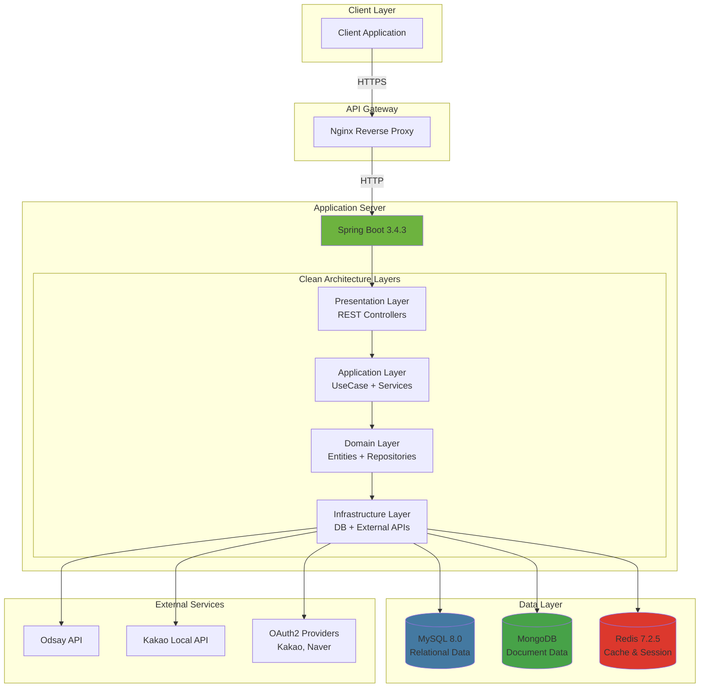
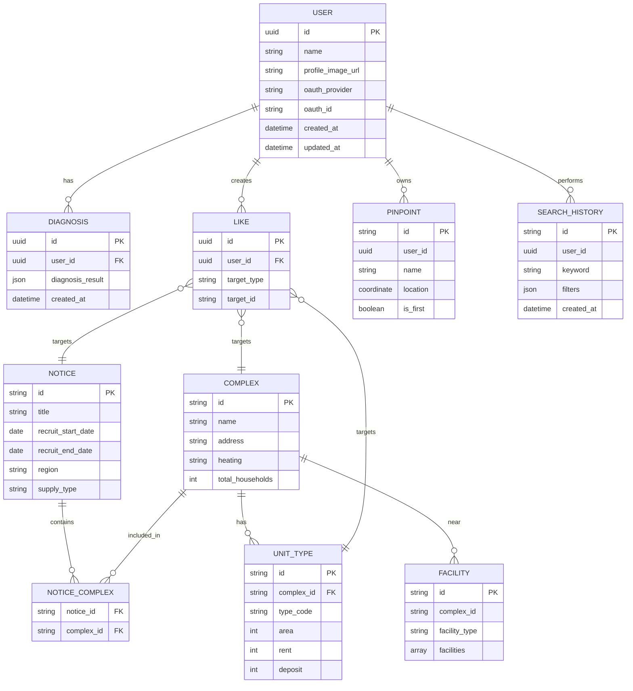
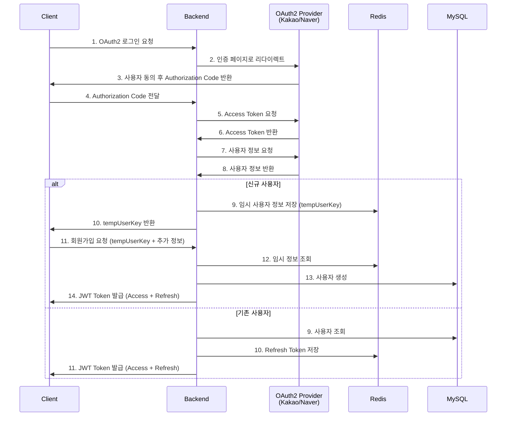

<div align="center">

# 🏠 PinHouse

**공공 임대주택 정보 및 청약 진단 플랫폼**

[](https://openjdk.org/)
[](https://spring.io/projects/spring-boot)
[](https://gradle.org/)
[](https://www.mongodb.com/)
[](https://www.mysql.com/)
[](https://redis.io/)

[기술 스택](#-기술-스택) • [아키텍처](#-아키텍처) • [주요 구현 사항](#-주요-구현-사항)

</div>

---

## 📋 목차

- [프로젝트 소개](#-프로젝트-소개)
- [주요 기능](#-주요-기능)
- [기술 스택](#-기술-스택)
- [아키텍처](#-아키텍처)
- [데이터베이스 설계](#-데이터베이스-설계)
- [프로젝트 구조](#-프로젝트-구조)
- [주요 구현 사항](#-주요-구현-사항)
- [성능 최적화](#-성능-최적화)
- [보안](#-보안)
- [CI/CD](#-cicd)

---

## 🎯 프로젝트 소개

**PinHouse**는 공공 임대주택 정보를 제공하고 사용자의 청약 자격을 진단하는 플랫폼입니다.
복잡한 청약 정보를 직관적으로 제공하며, 위치 기반 서비스를 통해 사용자 맞춤형 주택 정보를 제공합니다.

### 🌟 핵심 가치

- **정보 투명성**: 공공 임대주택 데이터를 통합하여 투명하게 제공
- **맞춤형 진단**: 사용자 상황에 맞는 청약 자격 자동 진단
- **위치 기반 추천**: 직장/학교 등 관심 위치 기반 최적 주택 추천
- **사용자 경험**: 복잡한 정보를 직관적이고 편리하게 제공

---

## ✨ 주요 기능

### 🔐 인증 및 사용자 관리
- **소셜 로그인**: Kakao, Naver OAuth2 인증
- **JWT 기반 인증**: Access/Refresh Token을 통한 보안 강화
- **마이페이지**: 프로필 관리, 좋아요 목록, 진단 이력 조회

### 🏘️ 주택 정보 관리
- **단지 정보**: 임대주택 단지의 상세 정보 제공
  - 난방방식, 총세대수, 공급호수
  - 방 타입별 정보 (면적, 임대료, 관리비)
  - 주변 인프라 정보 (카페, 편의점, 병원, 학교 등)

- **공고 검색**: 다양한 필터링 및 정렬 옵션
  - 지역, 공급 유형, 가격 범위, 면적별 검색
  - 커서 기반 무한 스크롤 페이지네이션
  - 인기순, 최신순 정렬

- **방 비교 기능**: 여러 방 타입을 한눈에 비교

### 📍 위치 기반 서비스
- **핀포인트**: 사용자의 관심 위치 등록 (직장, 학교, 부모 집 등)
- **거리 시뮬레이터**: Odsay API를 활용한 대중교통 경로 계산
  - 총 소요 시간, 거리, 요금 정보
  - 구간별 상세 경로 (승차/하차 정보, 노선 색상)
  - 최대 3개 경로 제공

### 🎓 청약 진단 시스템
- **자격 진단**: 사용자의 소득, 자산, 가족 구성원 정보 기반 청약 가능 여부 판단
- **규칙 엔진**: 공급 유형별 복잡한 청약 자격 규칙 자동 적용
  - 신혼부부 특별공급
  - 다자녀 가구 특별공급
  - 생애최초 특별공급
  - 청년 특별공급
- **진단 이력 관리**: 과거 진단 결과 저장 및 조회

### 🔍 검색 및 필터링
- **빠른 검색**: 지역, 방 타입, 임대료 범위로 간편 검색
- **고급 검색**: 키워드 기반 검색 및 다양한 필터 조합
- **인기 검색어**: 실시간 인기 검색어 제공
- **검색 기록**: MongoDB 기반 사용자별 검색 이력 추적

### ❤️ 좋아요 및 북마크
- 공고, 단지, 방 타입에 대한 좋아요 기능
- 로그인 사용자별 좋아요 목록 관리

---

## 🛠 기술 스택

### Backend
- **Language**: Java 21
- **Framework**: Spring Boot 3.4.3
- **Build Tool**: Gradle 8.x
- **Architecture**: Clean Architecture (4-Layer)

### Database
- **MySQL 8.0**: 관계형 데이터 (사용자, 공고, 단지, 진단 결과)
- **MongoDB**: 문서 기반 데이터 (핀포인트, 검색 이력, 주변시설)
- **Redis 7.2.5**: 세션 관리 (JWT Refresh Token, 임시 사용자 정보)

### Security & Auth
- **Spring Security**: 보안 프레임워크
- **OAuth2 Client**: 소셜 로그인 (Kakao, Naver)
- **JWT**: `io.jsonwebtoken:jjwt-api:0.11.5`

### Infrastructure
- **Docker & Docker Compose**: 컨테이너화
- **Nginx**: 리버스 프록시
- **Certbot**: SSL/TLS 인증서 관리

### DevOps
- **GitHub Actions**: CI/CD 자동화
- **JUnit 5**: 단위 및 통합 테스트

### External APIs
- **Odsay API**: 대중교통 경로 및 시간 계산
- **Kakao Local API**: 주소-좌표 변환
- **OAuth2 Providers**: Kakao, Naver

### Documentation & Monitoring
- **Swagger/OpenAPI**: `springdoc-openapi-starter-webmvc-ui:2.8.6`
- **Spring Actuator**: 애플리케이션 모니터링

---

## 🏗 아키텍처

### 시스템 아키텍처



### Clean Architecture (4-Layer)

```
┌─────────────────────────────────────────────────────────┐
│                   Presentation Layer                     │
│              (REST API Controllers - *Api.java)          │
└───────────────────┬─────────────────────────────────────┘
                    │ depends on
┌───────────────────▼─────────────────────────────────────┐
│                  Application Layer                       │
│        UseCase Interfaces + Service Implementations      │
│                   (Business Logic)                       │
└───────────────────┬─────────────────────────────────────┘
                    │ depends on
┌───────────────────▼─────────────────────────────────────┐
│                    Domain Layer                          │
│            Entities + Repository Interfaces              │
│                 (Business Rules)                         │
└───────────────────┬─────────────────────────────────────┘
                    │ depends on
┌───────────────────▼─────────────────────────────────────┐
│               Infrastructure Layer                       │
│      Repository Implementations + External APIs          │
└─────────────────────────────────────────────────────────┘
```

### 도메인 모듈 구조

각 도메인은 일관된 패키지 구조를 따릅니다:

```
<domain>/
├── presentation/           # REST API 엔드포인트
│   ├── *Api.java          # Controller
│   └── swagger/           # API 명세
├── application/
│   ├── usecase/           # UseCase 인터페이스
│   ├── service/           # UseCase 구현
│   └── dto/               # Request/Response DTO
│       ├── request/
│       └── response/
├── domain/
│   ├── entity/            # JPA/MongoDB Entity
│   └── repository/        # Repository Interface
└── external/              # 외부 API 통합 (선택)
```

### 데이터베이스 아키텍처

```
┌──────────────┐     ┌──────────────┐     ┌──────────────┐
│    MySQL     │     │   MongoDB    │     │    Redis     │
│              │     │              │     │              │
│  - User      │     │ - PinPoint   │     │ - JWT Token  │
│  - Complex   │     │ - Search     │     │ - TempUser   │
│  - Notice    │     │   History    │     │              │
│  - Diagnosis │     │ - Facility   │     │              │
│  - Like      │     │              │     │              │
└──────────────┘     └──────────────┘     └──────────────┘
```

---

## 💾 데이터베이스 설계

### Entity Relationship Diagram



### MySQL (Relational Data)

**User 테이블**
- 사용자 기본 정보 (이름, 프로필 이미지, OAuth 정보)
- 진단 결과와 1:N 관계
- 좋아요와 1:N 관계

**Complex 테이블**
- 임대주택 단지 정보
- Notice와 N:M 관계 (하나의 공고에 여러 단지)
- UnitType과 1:N 관계

**Notice 테이블**
- 청약 공고 정보
- 모집 기간, 당첨자 발표일, 계약일 등

**Diagnosis 테이블**
- 청약 진단 결과 저장
- 사용자 소득, 자산, 가족 구성원 정보

**Like 테이블**
- 사용자별 좋아요 정보
- 공고, 단지, 방 타입 구분

### MongoDB (Document-based Data)

**PinPoint Collection**
- 사용자의 관심 위치 정보
- Kakao Local API를 통한 좌표 데이터
- 즐겨찾기(first) 여부

**SearchHistory Collection**
- 사용자별 검색 기록
- 검색 키워드, 필터 조건, 타임스탬프

**Facility Collection**
- 단지 주변 시설 정보
- 카테고리별 시설 목록

### Redis (Cache & Session)

- **JWT Refresh Token**: 토큰 갱신용 리프레시 토큰 저장
- **TempUserInfo**: OAuth2 인증 후 회원가입 전 임시 사용자 정보

---

## 📁 프로젝트 구조

```
server/
├── src/
│   ├── main/
│   │   ├── java/com/pinHouse/server/
│   │   │   ├── core/                      # 공통 관심사
│   │   │   │   ├── aop/                   # @CheckLogin AOP
│   │   │   │   ├── config/                # Swagger, DB 설정
│   │   │   │   ├── exception/             # 예외 처리
│   │   │   │   ├── response/              # 표준 응답
│   │   │   │   └── util/                  # 유틸리티
│   │   │   ├── security/                  # 보안 및 인증
│   │   │   │   ├── auth/                  # OAuth2 처리
│   │   │   │   ├── jwt/                   # JWT 토큰
│   │   │   │   ├── oauth2/                # OAuth2 설정
│   │   │   │   └── config/                # Security 설정
│   │   │   └── platform/                  # 비즈니스 도메인
│   │   │       ├── user/                  # 사용자
│   │   │       ├── housing/               # 주택 정보
│   │   │       │   ├── complex/           # 단지
│   │   │       │   ├── notice/            # 공고
│   │   │       │   └── facility/          # 주변시설
│   │   │       ├── diagnostic/            # 청약 진단
│   │   │       │   ├── diagnosis/
│   │   │       │   ├── school/
│   │   │       │   └── rule/
│   │   │       ├── pinPoint/              # 핀포인트
│   │   │       ├── like/                  # 좋아요
│   │   │       └── search/                # 검색
│   │   └── resources/
│   │       ├── application.yml
│   │       ├── application-local.yml
│   │       └── application-dev.yml
│   └── test/                              # 테스트 코드
├── pinhouse_docker/                       # Docker 설정
│   └── docker-compose.yml
├── build.gradle
├── CLAUDE.md                              # 개발 가이드
└── README.md
```

---

## 🔧 주요 구현 사항

### OAuth2 인증 흐름



### 1. Clean Architecture 적용

**의존성 역전 원칙 (DIP) 준수**
```java
// UseCase Interface (Application Layer)
public interface ComplexUseCase {
    ComplexDetailResponse getComplex(String id, String pinPointId);
}

// Service Implementation
@Service
@RequiredArgsConstructor
public class ComplexService implements ComplexUseCase {
    @Override
    public ComplexDetailResponse getComplex(String id, String pinPointId) {
        // 구현
    }
}

// Controller는 UseCase 인터페이스에 의존
@RestController
@RequiredArgsConstructor
public class ComplexApi {
    private final ComplexUseCase complexUseCase;  // 구현이 아닌 인터페이스에 의존
}
```

### 2. AOP를 통한 인증 처리

```java
@CheckLogin  // 커스텀 어노테이션
@GetMapping("/mypage")
public ApiResponse<MyPageResponse> getMyPage(
    @AuthenticationPrincipal PrincipalDetails principalDetails
) {
    UUID userId = principalDetails.getId();
    // 비즈니스 로직
}
```

**LoginCheckAspect**가 `@CheckLogin` 메서드 호출 전에 인증 여부를 자동 검증합니다.

### 3. 다층 데이터베이스 전략

**MySQL** - 정형 데이터 (JPA)
```java
@Entity
@Table(name = "users")
public class User extends BaseTimeEntity {
    @Id
    @GeneratedValue(strategy = GenerationType.IDENTITY)
    private UUID id;

    @OneToMany(mappedBy = "user")
    private List<Diagnosis> diagnoses;
}
```

**MongoDB** - 비정형 데이터
```java
@Document(collection = "pinpoints")
public class PinPointDocument {
    @Id
    private String id;

    private Coordinate coordinate;  // Nested Document
    private List<String> tags;      // 유연한 스키마
}
```

**Redis** - 세션 및 캐싱
```java
@RedirectAttributes
public void saveRefreshToken(UUID userId, String refreshToken) {
    redisTemplate.opsForValue()
        .set("RT:" + userId, refreshToken, 7, TimeUnit.DAYS);
}
```

### 4. 복잡한 규칙 엔진 구현

**Chain of Responsibility 패턴을 활용한 청약 자격 판단**

```java
public interface DiagnosisRule {
    boolean matches(RuleCriteria criteria);
    DiagnosisResult apply(UserInfo userInfo);
}

@Component
public class RuleChain {
    private final List<DiagnosisRule> rules;

    public DiagnosisResult diagnose(UserInfo userInfo, RuleCriteria criteria) {
        return rules.stream()
            .filter(rule -> rule.matches(criteria))
            .findFirst()
            .map(rule -> rule.apply(userInfo))
            .orElse(DiagnosisResult.notEligible());
    }
}
```

### 5. 효율적인 페이지네이션

**Cursor 기반 무한 스크롤**
```java
public record SliceRequest(
    int page,
    int size
) {
    public Pageable toPageable() {
        return PageRequest.of(page, size + 1);  // N+1 조회
    }
}

public record SliceResponse<T>(
    List<T> content,
    boolean hasNext
) {
    public static <T> SliceResponse<T> from(Page<T> page) {
        boolean hasNext = page.getContent().size() > page.getSize();
        List<T> content = hasNext
            ? page.getContent().subList(0, page.getSize())
            : page.getContent();
        return new SliceResponse<>(content, hasNext);
    }
}
```

### 6. 표준화된 API 응답

```java
public record ApiResponse<T>(
    boolean success,
    T data,
    ErrorResponse error
) {
    public static <T> ApiResponse<T> ok(T data) {
        return new ApiResponse<>(true, data, null);
    }

    public static <T> ApiResponse<T> error(ErrorCode errorCode) {
        return new ApiResponse<>(false, null,
            new ErrorResponse(errorCode.getCode(), errorCode.getMessage()));
    }
}
```

### 7. 대중교통 경로 정보 최적화

**TransitInfoResponse** - 전체 경로 정보와 구간별 정보 분리
```java
public record TransitInfoResponse(
    String totalTime,              // "약 1시간 23분"
    Integer totalTimeMinutes,      // 83
    Double totalDistance,          // 39.6 (km)
    List<SegmentResponse> segments // 구간별 상세 정보
) {}
```

이를 통해 중복 데이터를 제거하고 API 응답 크기를 최적화했습니다.

---

## ⚡️ 성능 최적화

### 1. 다층 데이터베이스 전략
- **MySQL**: 정형화된 트랜잭션 데이터
- **MongoDB**: 복잡한 검색 쿼리 및 유연한 스키마
- **Redis**: 세션 캐싱으로 DB 부하 감소

### 2. 커서 기반 페이지네이션
- Offset 방식 대신 Cursor 기반 무한 스크롤 구현
- 대량 데이터 조회 시 성능 최적화 (O(n) → O(1))

### 3. DTO 최적화
- Java Record 타입으로 불변 객체 생성
- 중복 데이터 제거 (TransitInfoResponse 구조 개선)

### 4. N+1 문제 해결
- JPA Fetch Join 및 EntityGraph 활용
- 연관 관계 데이터 한 번에 조회

### 5. AOP를 통한 횡단 관심사 분리
- `@CheckLogin` 어노테이션으로 인증 로직 중복 제거
- 비즈니스 로직에 집중 가능

---

## 🔒 보안

### 인증 및 인가
- **JWT 기반 인증**: Stateless 인증으로 확장성 확보
- **Refresh Token**: Redis에 저장하여 보안 강화
- **OAuth2**: 소셜 로그인으로 패스워드 관리 부담 제거

### 보안 설정
- **CORS 설정**: 허용된 도메인만 API 접근 가능
- **HTTPS**: Nginx + Certbot으로 SSL/TLS 적용
- **SQL Injection 방지**: JPA Prepared Statement 사용

---

## 🔄 CI/CD

### GitHub Actions Workflows

**1. CI Test (`ci-test.yml`)**
- **트리거**: Pull Request to `develop`
- **작업**:
  - MySQL, Redis, MongoDB 서비스 컨테이너 실행
  - `./gradlew clean build` 실행 (테스트 포함)
  - JUnit 테스트 결과 발행

**2. Dev Deployment (`dev-ci-cd.yml`)**
- **트리거**: Push to `develop`
- **작업**:
  - Docker 이미지 빌드
  - Dev 서버 배포

### 개발 워크플로우

```
feature/* → PR → develop (CI Test) → merge → develop (Deploy to Dev)
```

---

## 📸 스크린샷 (Screenshots)

> 📝 **Note**: 실제 프로젝트 스크린샷을 추가하면 포트폴리오 효과가 극대화됩니다.
> - Swagger API 문서 화면
> - 시스템 모니터링 대시보드
> - 데이터베이스 ERD 다이어그램
> - 주요 기능 동작 화면

---

## 👥 개발 팀

**Backend Team**
- Spring Boot, Clean Architecture, Multi-Database Design
- OAuth2, JWT 인증/인가 구현
- 복잡한 비즈니스 로직 설계 (청약 진단 규칙 엔진)
- Odsay API 연동 및 대중교통 경로 최적화
- Kakao Local API를 활용한 좌표 변환 시스템

---

## 📄 라이센스

이 프로젝트는 MIT 라이센스를 따릅니다.

---

## 📞 문의

프로젝트에 대한 질문이나 제안이 있으시면 이슈를 등록해주세요.

**Repository**: [PinHouse GitHub](https://github.com/PinHouse/PinHouse_BE)

---

<div align="center">

**Built with ❤️ by PinHouse Team**

</div>
